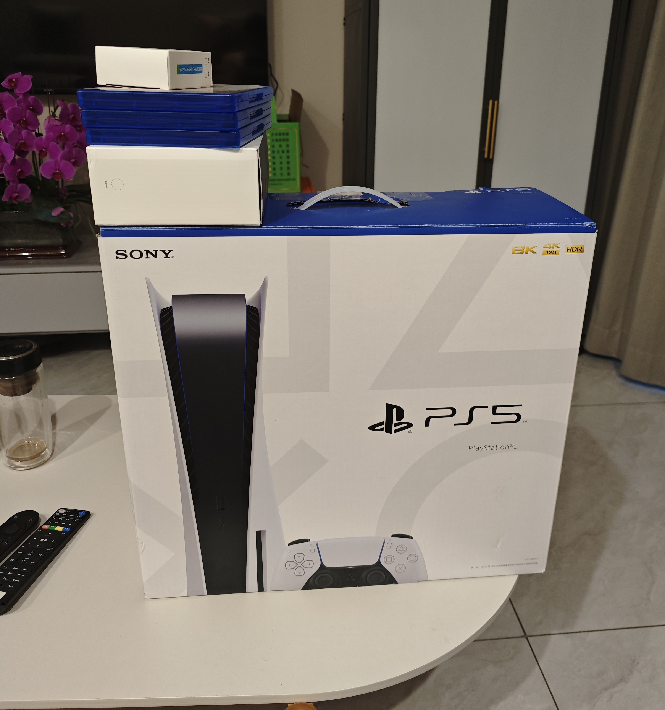
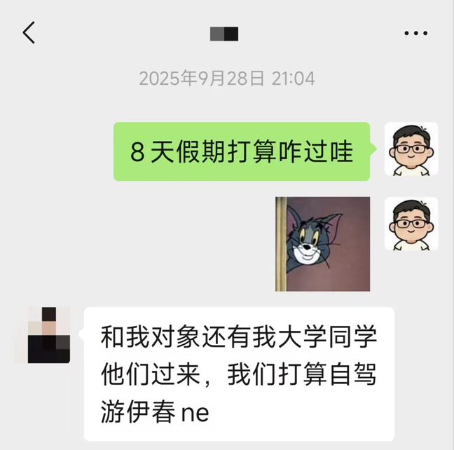

*这篇文章还是写在这里比较合适，因为当事人还在我的微信列表里，所以我决定不把这篇文章发到朋友圈，以免打扰到她的生活。*

人在坠入爱河的时候是会丧失掉理智的，我在喜欢她的那个阶段，沉迷于用DeepSeek和ChatGPT抽塔罗牌算运势来进行推演我和她之间的关系进展。而且后来我也花了点小钱请周围会易经的老哥帮我算了一下命，当时得出的结论是：我俩2025年处不上，我要是锲而不舍一直追2026年能处上。其实不管是塔罗牌也好易经也罢，最关键的一点我没有掌握住，那就是没有告白的勇气。

单相思实际上是非常消耗人的精力的一件事，因为别人的一个动作一句语言我会在脑中反复过好多遍，一直在想这么做对不对那么做对不对，而且爆炸式的给人家女孩发微信，而且不回信息的时候非常之闹心。话题岔开一下，微信上聊女孩对我来说是个客场，我喜欢这俩姑娘我都在微信上联系，聊。最后都没谈成，哎。其实人家不回信息也是可以理解的，谁都不想回复那老长一串的车轱辘话。

我是什么时候开始喜欢她的呢？肯定不是一开始见到就触电。因为我一开始对她的印象一般，我是在她即将去市里中医院规培的时候，开始感受到对她有所好感，人总是在他人的离开，物品的失去的时候才知道其珍贵。

后来我和友人闲聊的时候他和我讲，我当时基本上就是因为周围同龄女孩太少了，有一个就感觉想和人家发展发展。他讲的这个理论对也不对，对的点在于我周围的女孩确实是少，不对的点在于我不是所有人都会去发展的，这个女孩身上还是有一些特质我比较喜欢的。

这篇博客的封面是她的MacBook，当时她借给我用了两天，我尝了个新鲜。她讲她选择苹果阵营的电脑而不是选择Windows阵营是因为MacBook的稳定，追求稳定似乎是她的一个长久的追求，因为她的原生家庭并不是很幸福的，细节我在这里也不多说了，当时喜欢她的时候也想以后给她一个稳定的生活环境，然后就非常后悔在2024年没有努力学习，当时我记得2025年单相思犯病最严重的那几个月里，我的学习效率确实要比以前高很多，一个男人爱上一个女人的时候，首先改变的一定是他自己。

我本身也是一个游戏宅，我当时手里有一台二手的PS5。有一天实习老师有事提前离开了，她就拿出来她的Nintendo Switch，我就和她讲我有一台PS5如果她有兴趣的话我借她玩两天，但是我借她PS5玩儿这一个操作属于明修栈道暗度陈仓，表面上是师姐师弟之间沟通感情，实际上是我想泡她。

后来我亲爹在发现我借她PS5我心爱的PS5游戏机后也揣摩透了我的心思，直接说我的行为特别的幼稚，以后别干这事了。虽然没有明说知道了我喜欢她，但是基本上也表明了我爹的态度。再后来她还给我PS5之后，把她的Nintendo Switch借给我了，不过我没有玩放家里两天就还了回去。

我原来也想打印出她的一张照片留存下来，当一个书签使用挺浪漫的，不过后来照片让我烧掉了，因为一个是因为感觉我俩的缘分不是特别特别深，再一个当时我确实是累了，不想在单相思了。

我对她的感情是因为两个事情结束的：

我通过通讯录查找她QQ后看到了她以前的QQ空间，我加她QQ后她没回应而且关闭了通讯录功能。*哎好吧，我也多少有点缠人了*

再一个因为在2025年十一假期前侧面知道了她有对象，当时的想法是：哎，终于结束了。

