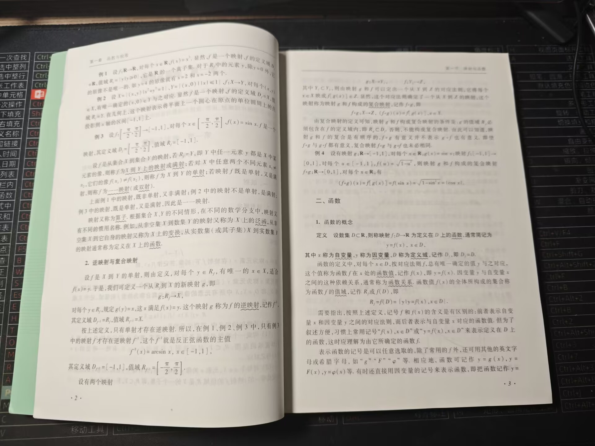
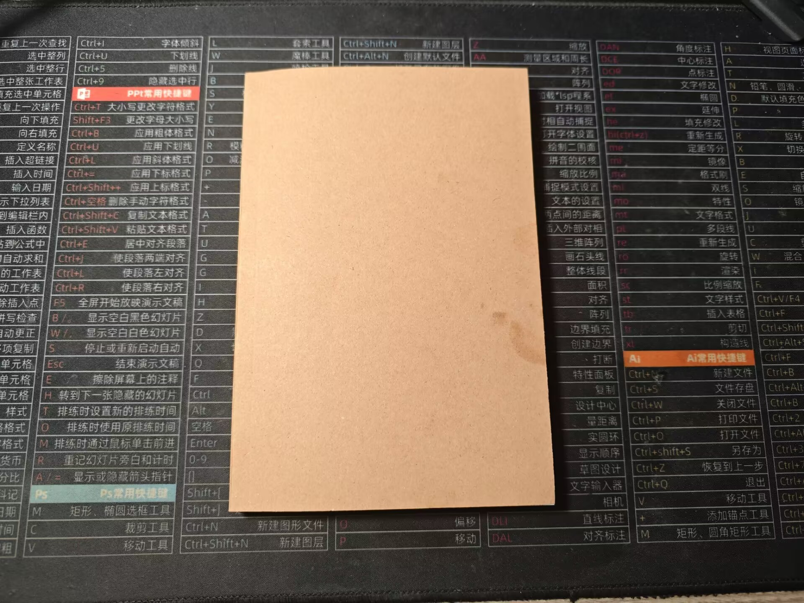
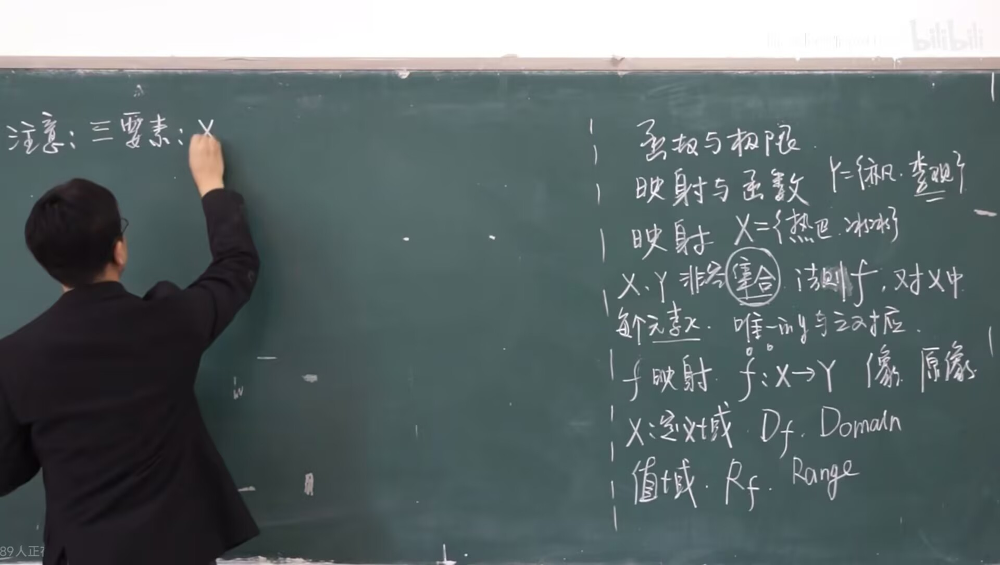

打开高等数学书，放眼望去既熟悉又陌生。

中学时代我最不喜欢学习的一门科目就是数学，如今为了更好的学习、应用计算机知识我选择重新开始数学的学习工作。我直接打开闲鱼反手20￥买了一套同济版的《高等数学》。

我是差不多7月上旬买的，途中因为卖家旅游去了，今天才刚刚到货。我看了书非常非常新，没有笔迹和折痕。好饭不怕晚大概就是这个道理。

笔记本我也准备好了，我在抖音商城上面0.01￥买的。

数学是逻辑思维的体操，我选择的体操教练是B站上的宋浩老师。

现在看到介绍数学原理的短视频我也会停留一下，今天看到用正方形面积验证平方和公式例子，感觉醍醐灌顶。

曾经那么恨的一个学科，过了差不多6年不学数学了，现在却成了我的心头好，有一种小别胜新婚的美感。