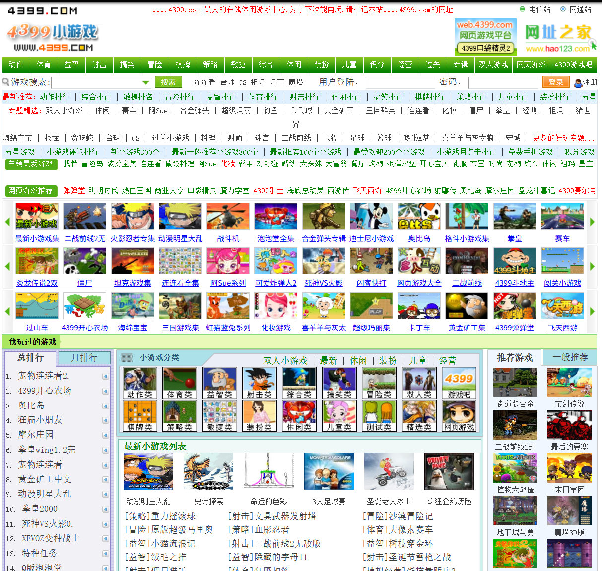
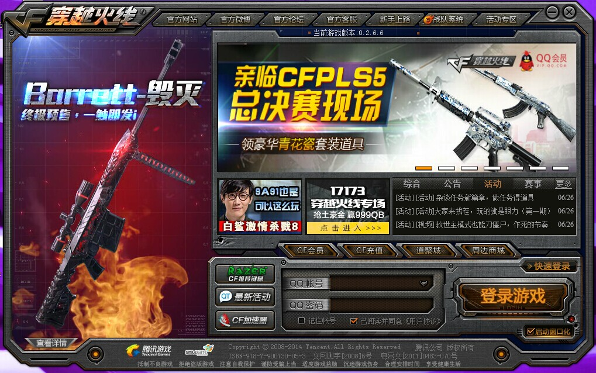
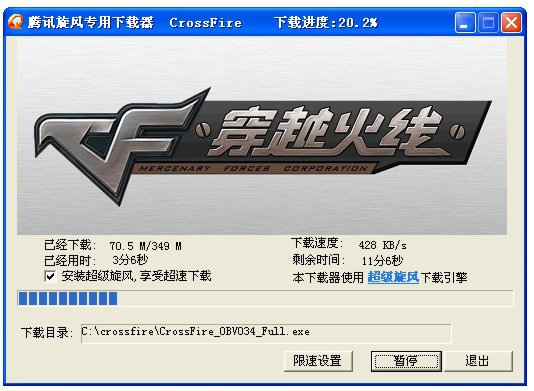
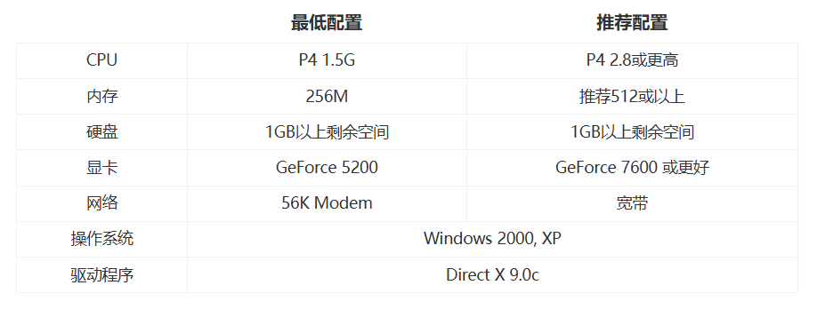
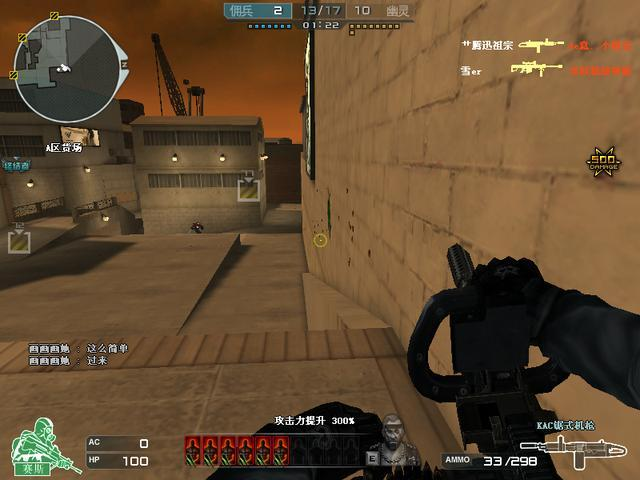
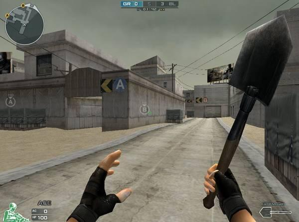

### 在字节的海滩上冲浪——小游戏也有大乐趣
我接触互联网相对较早，2009年左右家里装了宽带，那是一个上网需要拨号上网的年代。家里面的老电脑配置偏低（2005年左右的联想整机），当时使用的显示器还是CRT大屁股显示器。在使用互联网的初期，我最大的快乐是上4399打游戏。
早起玩4399都是在发小的影响下入坑的，看着他玩各类的制作精良的Flash游戏，我们俩一人一命制玩着，快乐就是那样纯粹而简单。

2009年实际上是互联网内容百花齐放的年代，国内互联网远没有现在那样多的条条框框，那个时代Google搜索在国内还是可以直连使用的，哎好怀念。也有点后悔没在使用互联网的初期好好探索技术，而把那时候大量时间消费在了Flash游戏上。下方图片为2010年左右谷歌搜索的截图，那是一个谷歌还没有被墙的时代。

在上网的初期，我并不会独自下载安装应用软件，我想当然的认为QQ这种国民级软件都是“预装”在电脑中的，知道后来家里人为了玩欢乐斗地主找朋友来家里帮忙下载安装了QQ和QQ游戏大厅，在那里我遇到了我的启蒙网游——《穿越火线》(我没找到比较老的CF登陆器截图，但是毁灭大炮推出的这个版本的登陆器截图样式就是老CF的经典登陆器样式)

### 沉迷网游——三亿鼠标的枪战梦想
《穿越火线》（以下简称CF）实际上是我舅家我表哥带我入坑的，是他教我找到官网并且下载了客户端。当年网速400KB/s左右，一个CF客户端需要下载半个小时，但是我当时假期玩游戏我妈限制我游玩时间也是半小时。我消耗了一天的操作电脑的时间，却打开了一扇通往网游大千世界的大门。下图是我找到的CF古早时期的下载器，可以非常醒目的看到这个下载器的速度是400KB/s属于当年的标准速度了。

CF在中国的火爆，在我看来是一个必然事件。首先，CF对机器配置的要求不高，下图是CF在2008年配置刚推出时候的配置要求:

在当时基本上电脑都能满足这个最低配置，如果没满足，那真的很拉了。

再就是CF是用QQ登录的，QQ拥有大量的互联网忠实用户，而且黏性极大(我在表哥影响下入坑的)，非常容易吸引来更多的用户。而且QQ注册简单，登录CF没有什么门槛，下载安装登录即玩方便的很。

而且CF的游戏质量在当年腾讯接手之后也是比较可以的，再加上后来经常搞网页活动15:30准点在线送枪之类的活动也是增添不少人气。

当时最喜欢玩的模式是CF的生化模式，后来随着版本的更新慢慢喜欢玩救世主模式，挑战模式，终结者模式。这类和僵尸/丧尸对抗的模式。
CF玩的最爽的时候一个是在某个假期刷了一个假期的巨人城废墟，弄了一仓库的奖励箱子。另一个就是和我的高中同学大胡子同学在2018年用周末的时间玩16人终结者模式游走刀僵尸。

CF最早在里面充钱是有一个学期我考试考的不错，老妈直接给双重奖励，电脑游戏时长超级加倍，外加50￥零花钱。我犹豫了一段时间之后直接反手把里面的40￥充了QB，回家抽了CF里面的奖券，到手一个军用铁锹，于是乎开启了我的刀战时代...直到现在我上号玩CF也就只玩一玩刀战。

早些年间，我打开电脑就是为了玩CF，这种情况不知道持续了多久，可能一直到我近视戴眼镜之后才有所减轻吧...我想上网不能只是为了玩一个CF而已吧...我开始寻找其他有趣的事情...

### 字节海洋中的快艇
后来网速一年比一年快，从不到1MB/s的拨号网到40MB/s的光线。从传统互联网再到后来移动互联网的兴起，我在这其中密切的感受到了变化。我知道我已经从互联网时代的小木船下船了，坐上了互联网时代的快艇。